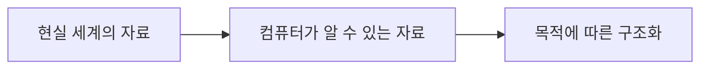

---
layout: center
headerEnable: true
headerTitle: 코딩테스트 대비 취업 특강
---

# 코딩 테스트 왜 해야하나?!

---
layout: default
headerEnable: true
headerTitle: 코딩테스트 대비 취업 특강
---

# 코딩 테스트의 목적

* 코딩 테스트를 왜 해야할까?
  * <danger>취업 준비를 위해 어쩔 수 없이...</danger>
  * <accent>문제 해결 능력을 기르기 위해</accent>
  * 코드 작성 능력을 향상시키기 위해
  * 알고리즘과 자료구조를 학습하기 위해
  * ...

---
layout: default
headerEnable: true
headerTitle: 코딩테스트 대비 취업 특강
---

# 문제 해결 능력이라는 관점

* 문제 해결 능력이란 무엇일까?
  * 주어진 문제를 해결하는 능력
  * 방법을 찾는 능력
  * 방법을 실행하는 능력
* 개발자의 경우...
  * 설계를 하는 능력
  * 코딩을 하는 능력
  * 지식과 경험
  * <accent>문제를 컴퓨터 관점에서 해결하는 능력</accent>

---
layout: center
headerEnable: true
headerTitle: 코딩테스트 대비 취업 특강
---

<spacer gap="10" />

# 대체 <accent>컴퓨팅 사고</accent>란 무엇일까?

---
layout: default
headerEnable: true
headerTitle: 코딩테스트 대비 취업 특강
---

# 어떠한 문제를 직면했을 때...

* 문제를 어떻게 바라볼 것인가?
  * 단순화
  * 추상화
  * 구조화
* <accent>컴퓨터라는 틀</accent>안에서 사고하기
  * 컴퓨터는 이 문제를 어떻게 처리할까?
  * 컴퓨터가 이해할 수 있는 데이터
  * 컴퓨터가 이해할 수 있는 논리

---
layout: default
headerEnable: true
headerTitle: 코딩테스트 대비 취업 특강
---

# 코딩 테스트 연습은 도움이 된다

* 컴퓨팅 사고를 기를 수 있다
* 자료를 어떻게 구조화할 것인지, 어떻게 다룰 것인지
* 크게보면 프로그램이란 <accent>순차, 조건, 반복, 참조</accent>의 조합
  * 이 기본기 조합을 어떻게 다룰 것인지 익혀나갈 수 있다
* 이때 아니면 연습할 일이 별로 없다

---
layout: default
headerEnable: true
headerTitle: 코딩테스트 대비 취업 특강
---

# 자료구조는 컴퓨터의 관점에서 자료를 다루는 것

필요에 따라 적절하게 자료를 구조화할 수 있는 능력이 필요

<spacer gap="10" />

---
layout: default
headerEnable: true
headerTitle: 코딩테스트 대비 취업 특강
---

# 알고리즘은 컴퓨터의 관점에서 데이터를 다루는 여러 방법을 제시

* 어떤 데이터가 필요한가?
* 데이터를 어떻게 변형할 것인가?
* 무엇에 따라 분기할 것인가?
* 몇 번 반복해야 하는가?

- - -

* 이후 알고리즘을 공부한다면 다음과 같은 것을 같이 생각해보자
  * 특정 로직에서 분기를 하는 이유
  * n만큼 반복을 하는 이유
  * 데이터를 변형하는 이유
  * 외부에 데이터를 저장해두고 참조하는 이유

